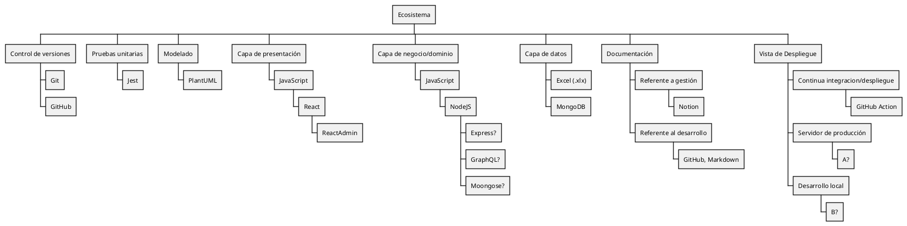
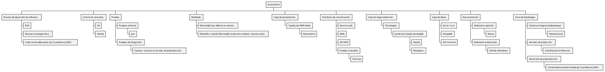

# Ecosistema

El ecosistema software es el sistema de tecnologías integradas manualmente cuyo fin es soportar el ciclo de vida del software: gestión, requisitos, análisis, diseño, construcción, pruebas y despliegue. A los elementos del sistema también se les llama herramientas CASE.

Nuestro ecosistema es el siguiente:

